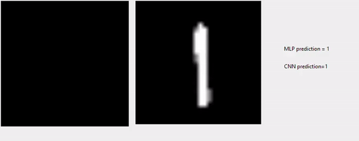

# digit-classifier
Handwritten Digit Recognition by Neural Networks

[](./readme-media/digit_classifier.gif)

### Dependencies
 - python
 - tensorflow
 - keras
 - numpy
 - matplotlib
 - openCV (for reading and resizing the image)
 - sklearn (for evaluation with confusion matrix)
 - tkinter & PIL (for GUI)

### Dataset Used
The MNIST dataset consists of a training set of 60000 examples and test set of 10000 examples. All digits have been size-normalized and centered in a fixed image of 28 × 28 size. In original dataset, each pixel in the image is represented by an integer between 0 and 255, where 0 is black, 255 is white and anything between represents different shade of gray.

### How to Use
Since this project is using ImageGrab from PIL module, gui will only work if you using windows.
1. Download/Clone this repository and extract the zip file.
2. Inside extracted folder run 
    ```sh
    python gui.py
    ```
3. Now, this gui will open. 

    [](./readme-media/digit_classifier.gif)

### License
----
MIT
**Free Software, Hell Yeah!**
